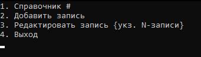
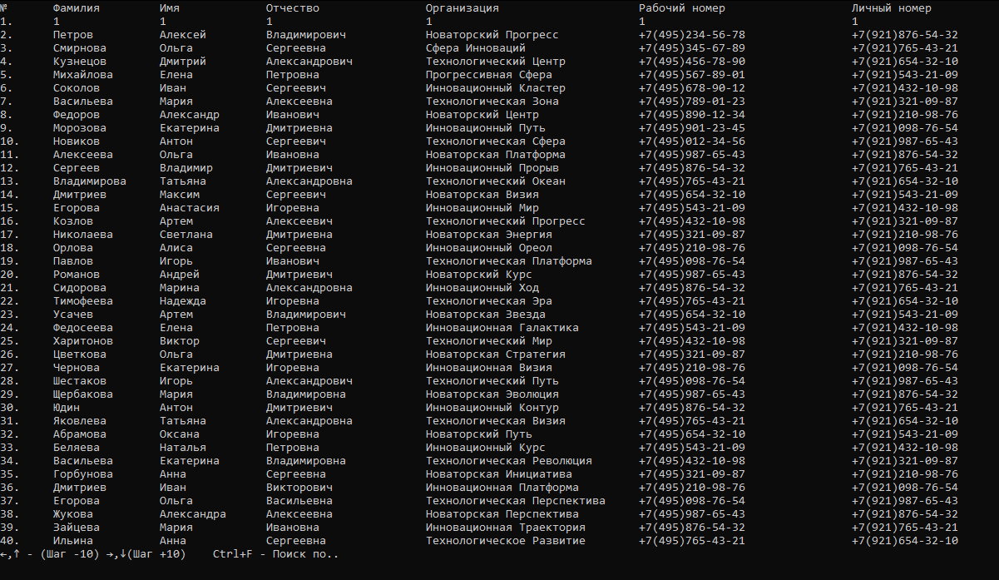
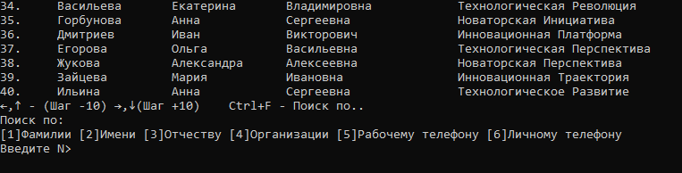

# Effective Mobile test task

Реализовать телефонный справочник со следующими возможностями:
1. Вывод постранично записей из справочника на экран
2. Добавление новой записи в справочник
3. Возможность редактирования записей в справочнике
4. Поиск записей по одной или нескольким характеристикам

Требования к программе:
1. Реализация интерфейса через консоль (без веб- или графического интерфейса)
2. Хранение данных должно быть организовано в виде текстового файла, формат которого придумывает сам программист.
3. В справочнике хранится следующая информация: фамилия, имя, отчество, название организации, телефон рабочий, телефон личный (сотовый)

Плюсом будет:

1. аннотирование функций и переменных
2. документирование функций
3. подробно описанный функционал программы
4. размещение готовой программы и примера файла с данными на github.


## Installation


Clone repo:
```sh
git clone https://github.com/alexroot-coder/alexroot-coder-test/task_Effective_Mobile.git
```
Run:
```sh
py -3.10 phonebook.py
```






## FeedBack

[](https://t.me/yavamnerobot)
[](mailto:alexrozhentsev@gmail.com)